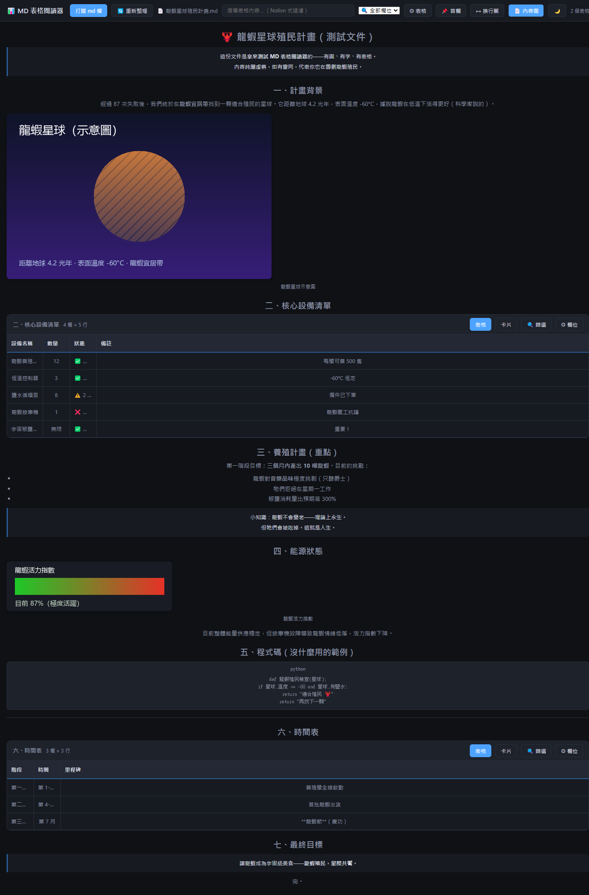

# 📊 MD Table Reader

> **Read markdown tables with an Excel/Notion-grade experience.**
> 讀 md 檔案的表格，享受 Excel/Notion 數據庫級的閱讀體驗。



**Latest: v5.0.1 (2026-08-19)** — 欄標題置中 — Filter, wrap toggle, non-F5 refresh, popup cards, non-table content (with images), portable build (natural image rendering).

## 📥 Download

| Version | File | Notes |
|---|---|---|
| **Portable (Windows x64)** | [MD-Table-Reader-Portable-5.0.1.exe](https://github.com/Shinemind-ops/md-table-reader/releases/download/v5.0.1/MD-Table-Reader-Portable-5.0.1.exe) | Electron, 71MB — **images render natively** (knows the file path), more stable non-F5 refresh |
| **Single-file HTML** | [md-table-reader.html](https://github.com/Shinemind-ops/md-table-reader/releases/download/v5.0.1/md-table-reader.html) | Zero install, double-click to use, no dependencies (browser build — relative images via 📁 directory picker) |

> Older versions: [v5.0.0](https://github.com/Shinemind-ops/md-table-reader/releases/tag/v5.0.0) ｜ [v4.0](https://github.com/Shinemind-ops/md-table-reader/releases/tag/v4.0) ｜ [v3.8 (commit)](https://github.com/Shinemind-ops/md-table-reader/commit/70cc240)

## ✨ Features

| Feature | Description |
|---|---|
| 🔍 **Notion-style filter** | Multi-condition filtering on any column — "is", "is not", "contains", "is any of (A、B、C)", AND across conditions |
| ↔️ **Wrap toggle** | Wrap long cells or truncate them — your call (off by default, remembers preference) |
| 🔄 **Non-F5 refresh** | Re-read the file after edits — new content appears instantly, **reader's state is untouched** (scroll/filter/widths/sort all preserved) |
| 🃏 **Popup cards** | Click any row for a full card — **including hidden columns** |
| 📄 **Non-table content (with images)** | Headings/quotes/paragraphs/lists/code/hr/images — Obsidian/Trae-grade typography, off by default |
| 🖼 **Native image rendering (portable)** | exe reads same-directory images automatically (fs access); HTML build uses 📁 directory picker |
| 📌 Frozen header / first column | Keep context while scrolling |
| ↔️ Column drag-resize | Pure addition — right column never moves |
| 🔀 Drag columns to reorder | Rearrange columns by dragging headers |
| ⚙️ Column show/hide | Per-column visibility, select all / none |
| ⚙️ Table show/hide | Show/hide individual tables in multi-table files |
| 🔍 Global & column-scoped search | Search all columns or a specific one |
| 🃏 Table view / Card view | Notion-style dual views |
| 🌙 Dark / light theme | Remembers preference |

## 🤔 Which build to choose?

| | Single-file HTML | Portable (exe) |
|---|---|---|
| Install | Zero — double-click | Zero — double-click (portable) |
| Size | 66KB | 71MB (bundled Chromium) |
| Same-directory images | 📁 picker required | **Native** |
| Non-F5 refresh | File System Access (Chromium) | Real file path — more robust |
| Best for | Quick reads, sharing | Daily driver, image-heavy docs |

## 🛠 Development

```
# Portable (Electron)
cd electron
npm install
npm start          # dev mode
npm run dist       # build portable exe → dist/

# HTML version
# Edit md-table-reader.html directly (single file, no dependencies)
```

Structure:
```
md-table-reader.html   # Single-file HTML (double-click to use)
electron/
  main.js              # Electron main (file dialog returns path + fs image read)
  preload.js           # contextBridge secure API
  renderer.html        # UI (synced from md-table-reader.html)
  package.json         # electron-builder config
docs/
  screenshot.png       # v4.0 screenshot
  screenshot-v5.png    # v5.0 screenshot
```

## 📜 License

MIT — free to use, modify, distribute.

---

# 中文版說明（中文使用者看這裡）

## 📥 下載

| 版本 | 檔案 | 說明 |
|---|---|---|
| **免安裝版（Windows x64）** | [MD-Table-Reader-Portable-5.0.1.exe](https://github.com/Shinemind-ops/md-table-reader/releases/download/v5.0.1/MD-Table-Reader-Portable-5.0.1.exe) | Electron 打包，71MB——**圖片自然顯示**（開啟即有圖）、非 F5 重新整理更穩 |
| **單檔 HTML** | [md-table-reader.html](https://github.com/Shinemind-ops/md-table-reader/releases/download/v5.0.1/md-table-reader.html) | 零安裝、雙擊即用、無依賴（瀏覽器版——相對路徑圖片用 📁 選目錄） |

> 歷史版本：[v5.0.0](https://github.com/Shinemind-ops/md-table-reader/releases/tag/v5.0.0) ｜ [v4.0](https://github.com/Shinemind-ops/md-table-reader/releases/tag/v4.0) ｜ [v3.8（commit）](https://github.com/Shinemind-ops/md-table-reader/commit/70cc240)

## ✨ 功能

| 功能 | 說明 |
|---|---|
| 🔍 **篩選器（Notion 式）** | 按廠商/類型/任何欄位多條件篩選——「是」「不是」「包含」「是任一（A、B、C）」，多條件 AND |
| ↔️ **自動換行開關** | 想換行就換行、想截斷就截斷（默認不換行，記住偏好） |
| 🔄 **非 F5 重新整理** | 檔案被編輯後一鍵重讀——新內容立即反映，**閱讀者的權力不受挑釁**（滾動/篩選/欄寬/排序全保留） |
| 🃏 **彈出式卡片** | 點任何一行彈出完整卡片——**含隱藏欄位**的完整資訊 |
| 📄 **非表格內容（含圖片）** | 標題/引用/段落/列表/程式碼/分隔線/圖片全部渲染——Obsidian/Trae 式清晰排版，默認不顯示可切換 |
| 🖼 **圖片自然顯示（免安裝版）** | exe 版開啟 md 即顯示同目錄圖片（fs 讀取）；HTML 版用 📁 選目錄 |
| 📌 凍結表頭 / 凍結首欄 | 滾動不失上下文 |
| ↔️ 欄寬拖拽 | 拖欄線調整欄寬（純加法，右欄分毫未動） |
| 🔀 拖欄重排 | 拖欄標題重排欄位 |
| ⚙️ 欄位顯示控制 | 每欄顯示/隱藏，全選/全不選 |
| ⚙️ 表格顯示控制 | 多表格檔案中控制顯示哪些表格 |
| 🔍 全域/分欄搜尋 | 搜全部欄位或指定欄位 |
| 🃏 表格視圖 / 卡片視圖 | Notion 式雙視圖 |
| 🌙 深/淺色主題 | 記住偏好 |

## 🤔 兩種版本怎麼選

| | 單檔 HTML | 免安裝版（exe） |
|---|---|---|
| 安裝 | 零——雙擊即用 | 零——雙擊即用（portable） |
| 體積 | 66KB | 71MB（內含 Chromium） |
| 同目錄圖片 | 📁 選目錄後顯示 | **自然顯示** |
| 非 F5 重新整理 | 需 File System Access（Chromium） | 有真實路徑——更穩 |
| 適合 | 快速看表格、分享 | 日常主力、看含圖 md |

## 🛠 開發

```
# 免安裝版（Electron）
cd electron
npm install
npm start          # 開發模式
npm run dist       # 打包 portable exe → dist/

# HTML 版
# 直接編輯 md-table-reader.html（單檔，無依賴）
```

結構：
```
md-table-reader.html   # 單檔 HTML 版（瀏覽器雙擊即用）
electron/
  main.js              # Electron 主進程（選檔回傳路徑 + fs 讀圖片）
  preload.js           # contextBridge 安全橋接
  renderer.html        # UI（從 md-table-reader.html 同步）
  package.json         # electron-builder 打包配置
docs/
  screenshot.png       # v4.0 截圖
  screenshot-v5.png    # v5.0 截圖
```

## 📜 License

MIT — 自由使用、修改、散佈。
